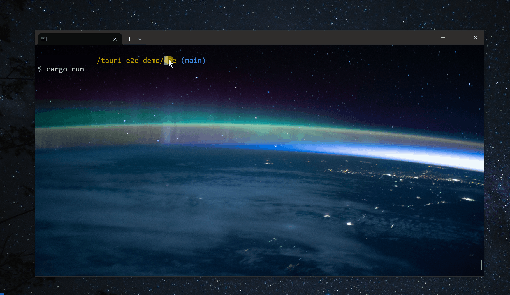

# tauri-windows-e2e-demo

This is an example of end-to-end testing for a Tauri v2 Beta application on Windows. The test should successfully click the button in the app.

## Prerequisites

0. Make sure you have [Cargo](https://doc.rust-lang.org/cargo/getting-started/installation.html) and [Bun](https://bun.sh) installed.
1. Install [tauri-driver](https://crates.io/crates/tauri-driver) and make it accessible from your PATH (run `cargo install tauri-driver`).
2. Install [msedgedriver.exe](https://developer.microsoft.com/en-us/microsoft-edge/tools/webdriver/?form=MA13LH#downloads) and make it accessible from your PATH.
3. Build the app first (`bun i && bun tauri build`) before running the end-to-end test (`cd e2e && cargo run`).

The [fantoccini](https://crates.io/crates/fantoccini) and [enigo](https://crates.io/crates/enigo) crates may be useful for further implementation.
